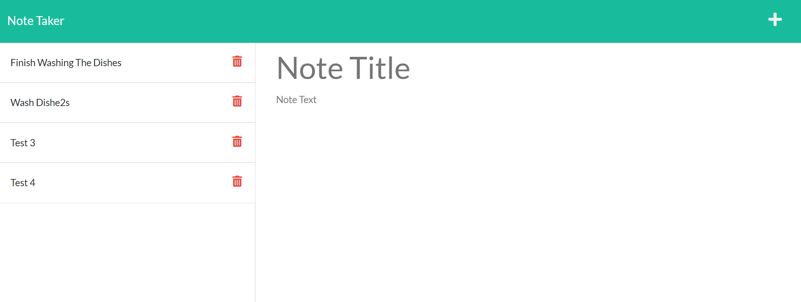
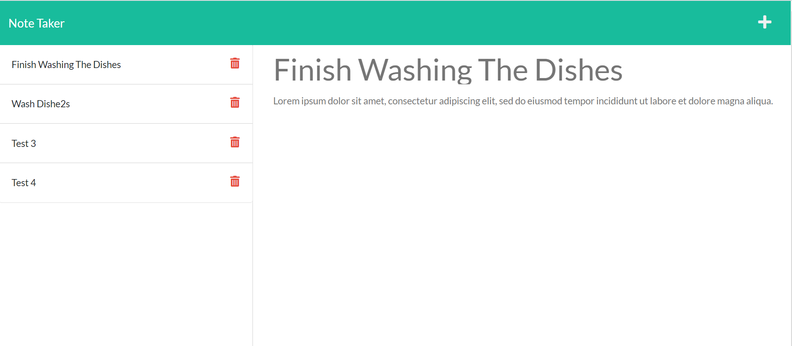

# Note Taker Code

# Description

In this module, I used node.js to build an application called Note Taker that can be used to write and save notes. This application will use an Express.js back end and will save and retrieve note data from a JSON file.The application’s front end has already been created. It's my job to build the back end, connect the two, and then deploy the entire application to Heroku.





# Pre-requisites

- Install [Node.js](https://nodejs.org/en/) version 8.0.0

# Getting started

- Clone the repository

```
git clone <git@github.com:shanebramble/note-taker.git> 
```

- Install dependencies

```
cd <project_name>
npm install
```

- Build and run the project

```
npm start
```

## Deployed Website

[Note-Taker-Site](https://still-brook-16172.herokuapp.com/)

### Built With

- HTML
- CSS
- JavaScipt
- Node.js
- Express

## Contribution

Made with ❤️ by Shane Bramble-Wade

### ©️2021 Note Taker, Inc
